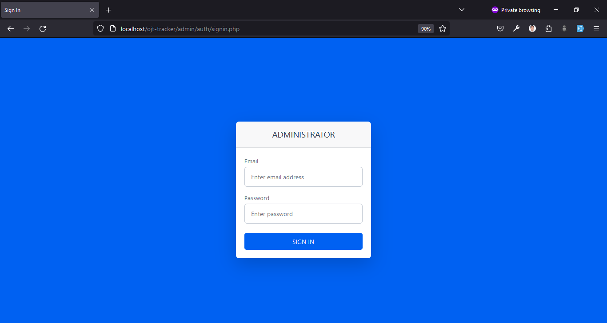
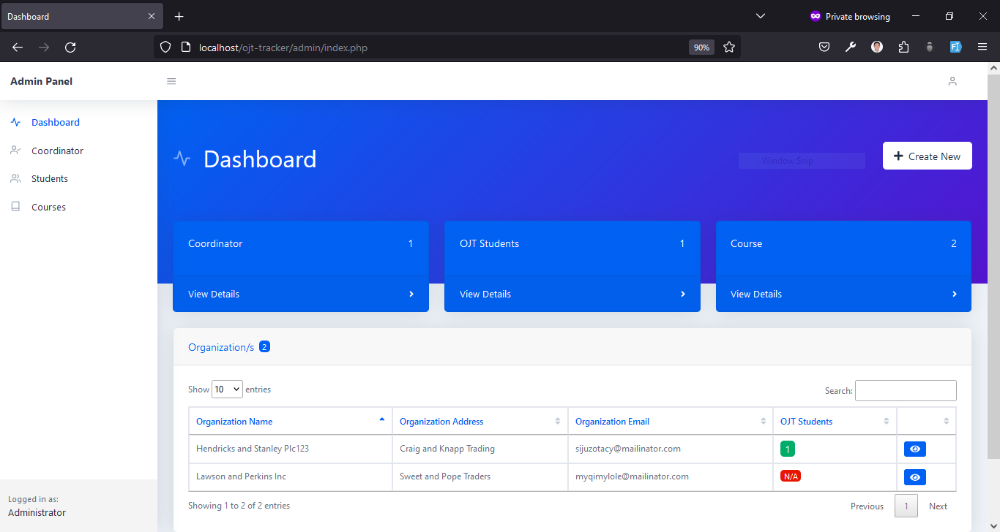
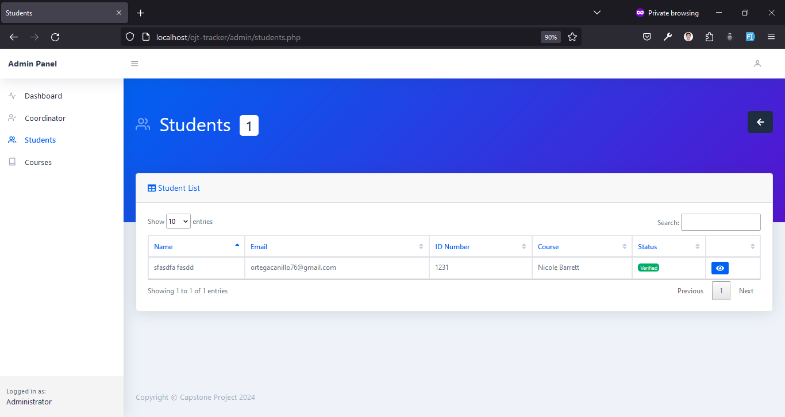
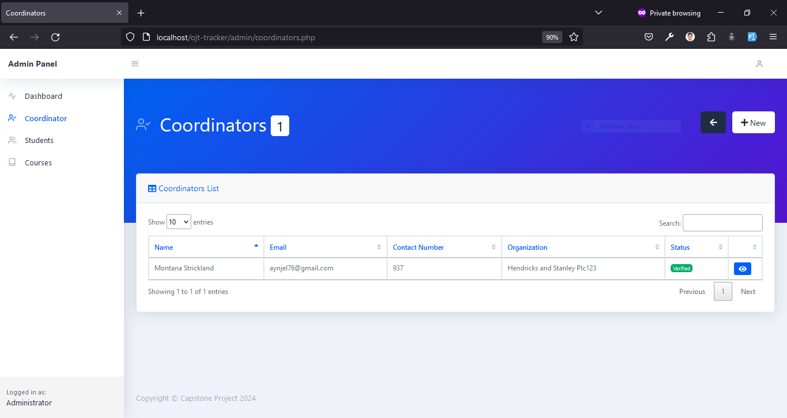
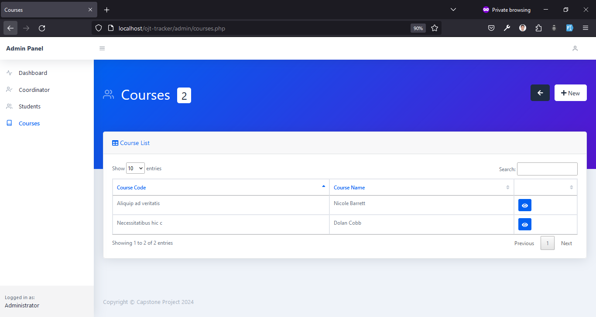
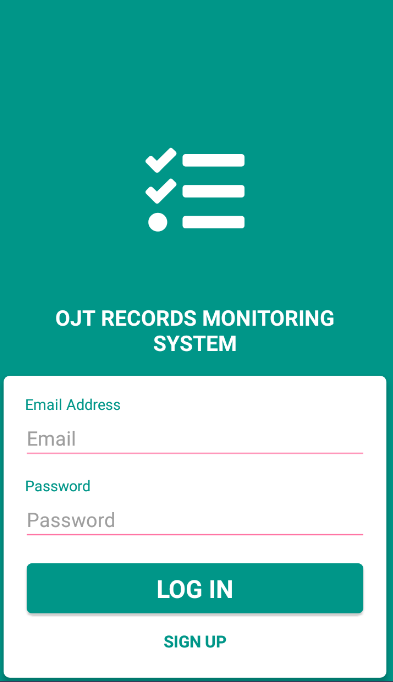
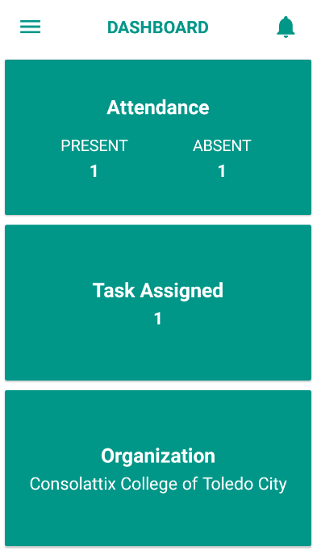
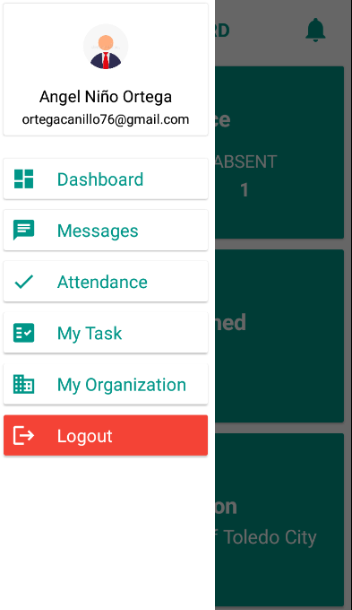
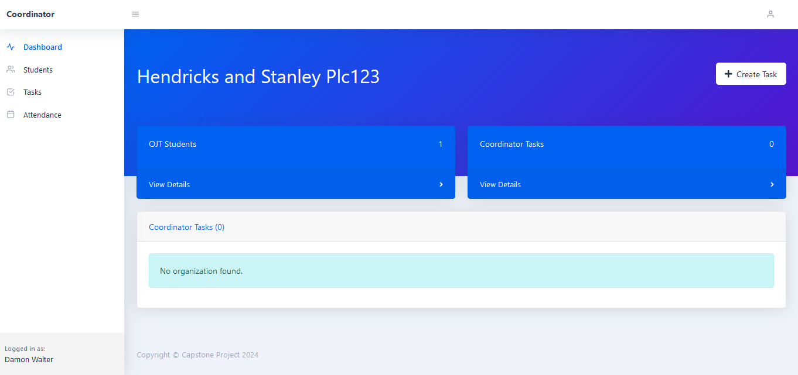

## OJT TRACKER: MOBILE APPLICATION FOR MONITORING OJT TRAINEES FOR THE OJT COLLEGE STUDENTS OF CONSOLATRIX COLLEGE OF TOLEDO CITY, INC

### Table of Contents

- [Introduction](#introduction)
- [Admin Module Features](#admin-module-features)
- [Student Module Features](#student-module-features)
- [Coordinator Module Features](#coordinator-module-features)

### Introduction

Consolatrix College of Toledo City Inc. has as one of its top priorities upgrading its facilities and resources to fulfill the mission for which it was founded, which is to provide more pertinent and worthwhile education and training. The Institution grew from a few students in its early years of operation, the school progressively increased its student body and gradually broadened its curriculum options.

On-the-Job Training (OJT), a component of the curriculum in Consolatrix College of Toledo City, aims to teach students about the workplace and their future careers. Currently, the institution offers a wide variety of supplementary courses. This gives students who are academically capable and motivated the chance to begin their career path while still in school. Three participants, namely the students, teachers, and the OJT coordinators, collaborate during the training.

The current procedure for the CCTC, the attendance of OJT Students, is manually writing in a logbook and placing it in a clear book together with its documents during their on-the-job training. And when the OJT students submit printed requirements to the OJT Coordinator, their papers are kept by the coordinator together with the other students. The students will just manually record and print all the tasks given by the coordinator. By doing this, the Coordinator and Students must spend more time, effort, and space keeping track of the OJT students' documents to secure information. Often, manual transactions must be redone rather than just updated when errors occur or when adjustments or corrections are required.

The study's main goal was to demonstrate the benefits of automating the tracking of records for on-the-job trainees. Verifying and keeping track of the trainee's service hours won't be difficult for the OJT Coordinator. A significant number of logbooks, terminal reports, and requirements will also be removed from his or her possession, and there is no risk of losing them. The system will be used to maintain and manage all the trainee’s records.

### Admin Module Features

Admin Login

Admin Dashboard

Admin Manage OJT Students

Admin Manage OJT Coordinators

Admin Manage OJT Courses

### Student Module Features

Student Login

Student Dashboard

Student Navigation Drawer

### Coordinator Module Features

Coordinator Login

Coordinator Dashboard

Coordinator Manage Password

### Documentation

- [Documentation](https://1drv.ms/w/s!Ap7p3TJ_9YGi4Hg7Ou76Zh-ikcao?e=A3iMwy)

### Technologies Used

- Programming Language: PHP, JavaScript, HTML, CSS
- Database: MySQL
- Mobile: Kodular (MIT App Inventor)
- Web: XAMPP

### Conclusion

- The project finished successfully and the system was able to meet the requirements of the client.
- The system was able to provide a more efficient way of tracking the records of the OJT students.
- Successfully defended the system to the panel of examiners.

### Acknowledgement

This work would not have the spirit it has without the guidance, support, and assistance of the following:

We would like to praise and thank God, the Almighty, who has granted countless blessings, knowledge, and opportunity to the writer so that I have been finally able to accomplish the thesis.

Josephine D. Ativo, A.R., Ph.D. for giving us her permission and for letting us conduct our study in Consolatrix College of Toledo City, Inc.

To the Panelists Mr. Eugine Lastimoso, Mr. Daniel Bert Uy, and Mr. Lloyd Lebumfacil for the valuable inputs to be included in this thesis and for generously spending precious time in giving guidance, encouragement, suggestion, and comments for this thesis.

We would like to show my greatest appreciation to Mr. Procoro V. Gonzaga, our research adviser. We can’t say thank you enough for her tremendous support and help. Without his encouragement and guidance, this thesis would not have materialized.

To Consolatrix College of Toledo City, Inc., and to our parents and guardians for supporting our aspirations in obtaining our dreams and aspiration in life.
